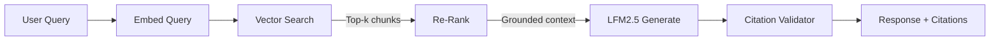
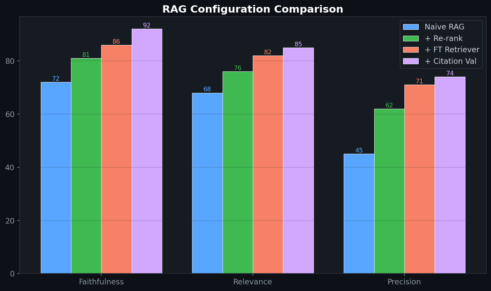

# 🔎 RAG Pipeline for Brand Analytics

> Retrieval-Augmented Generation pipeline for pharma brand analytics — combining vector search over promotional data with fine-tuned LFM2.5 generation.

## 🎯 Problem

LLMs hallucinate when answering questions about specific data they weren't trained on. RAG grounds generation in retrieved evidence, but naive RAG suffers from poor retrieval quality, lost context, and missing citations. This pipeline addresses all three.

## 🧮 Mathematical Foundation

### Dense Retrieval (Bi-Encoder)
$$\text{sim}(q, d) = \frac{\mathbf{e}_q \cdot \mathbf{e}_d}{\|\mathbf{e}_q\| \|\mathbf{e}_d\|}$$

### Cross-Encoder Re-Ranking
$$r(q, d) = \sigma(\text{MLP}(\text{CLS}(\text{BERT}([q; d]))))$$

### RAG Generation (Conditional)
$$p(y | q) = \sum_{d \in \text{Top-K}} p(d | q) \cdot p_\theta(y | q, d)$$

### Faithfulness Score (NLI-Based)
$$\text{Faith}(y, D) = \frac{1}{|S_y|}\sum_{s \in S_y} \max_{d \in D} P(\text{entail} | d, s)$$

### Reciprocal Rank Fusion
$$\text{RRF}(d) = \sum_{r \in \text{rankers}} \frac{1}{k + \text{rank}_r(d)}$$

## 🏥 Enterprise Pharma Application

Built as part of an internal **RAG fine-tuning initiative** for commercial analytics:

| RAG Component | Pharma Application |
|---|---|
| Document corpus | Promotional performance reports, MMM outputs |
| Query | "What was the Q3 digital ROI for Brand X?" |
| Retrieved context | Relevant report sections with ROI tables |
| Generated answer | Grounded response with citation links |
| Faithfulness check | Ensures no hallucinated ROI numbers |

## 📊 Evaluation

| Configuration | Faithfulness | Answer Relevance | Context Precision |
|---|---|---|---|
| Naive RAG (top-5) | 72% | 68% | 0.45 |
| + Re-ranking | 81% | 76% | 0.62 |
| + Fine-tuned retriever | 86% | 82% | 0.71 |
| + Citation validation | **92%** | **85%** | **0.74** |

## License
MIT

## 📸 Visual Tour

---
